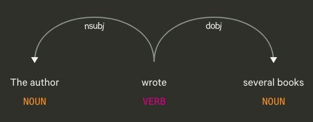

```{r setup, include=FALSE}
knitr::opts_chunk$set(echo = FALSE)
library(udpipe)
```

## Large Datasets Answer Questions

- Research in computational linguistics is improved by large copora or datasets
- Data can be used as data for hypothesis testing or stimuli selection for experimental research
- Open Subtitles Corpus (http://opus.nlpl.eu/OpenSubtitles-v2018.php) provides linguistic data for 50+ languages 
- Previous research with the subtitle corpora have shown their usefulness  (New et al., 2007; Brysbaert & New, 2009; Keuleers et al., 2010; Cuetos et al., 2012; Van Heuven et al., 2014; Mandera et al., 2015; and more)
- The corpora are freely available to download for use in linguistic projects

## Semantic Feature Production Norms

- The property listing task is used to create concept-feature norms 
- Participants are asked to list the properties of listed concepts
  - Dog \<is an animal\>, \<barks\>, \<has a tail\>
- The time and effort to create and clean comprehensive concept-features norms is lengthy
- However, concept-feature norms are useful, especially for measures of semantic similarity. 

## STRUDEL

- Baroni, Murphy, Barbu, & Poesio (2010)
- Structured Dimension Extraction and Labeling
- Proposed model that provides a structured way to extract concept-feature norms from large corpora
- Compared to the McRae norms, STRUDEL provides promising results:
  - Book \<reader\>, \<author\>, \<library\>, \<chapter\>
  
## Limitations of STRUDEL as Presented

- One key limitation to STRUDEL is the embedded rules of concept-property extraction that are focused on the English Language
- Extrapolating this structure to other langauges may not provide similar results, even as other languages have similar sentence structure 
- Additionally, the code is difficult to navigate requiring Perl and other installed corpus software

## Basic Concept of STRUDEL

:::: {.columns}
::: {.column width="50%"}
- The core idea of STRUDEL is dependency parsing
- Dependency parsers are avaliable in many languages
- `udpipe` provides an excellent package
:::
::: {.column width="50%"}
```{r echo=FALSE, out.width="80%"}

```
:::
::::

## Processing Steps

- Import the tokenized text version of the Open Subtitle Corpus
- For each sentence, use `udpipe` to process for part of speech tags, lemmas, and dependency parsing 
- Extract all nouns, verbs, and adjectives
- Extract dependency relations:  `"nsubj", "nmod", "obj", "iobj", "amod", "obl"`
- Provide frequencies of the combinations present in the corpus

## Example

```{r}
library(udpipe)
data.text <- "The author wrote several books"
#  Annotate the text
annotate <- udpipe(data.text, "english") 
# Convert to dataframe
annotated_df <- as.data.frame(annotate) 
# Examine results
annotated_df[ , c("token_id", "token", 
                  "lemma", "upos", "dep_rel", "head_token_id")]
```

## English Results

- 27,392,305 combinations of nouns, verbs, and adjectives across the subset of dependency relations
- 308,646,868 instances counted 
- 1 to 391,437 frequency (last-night)
- Examine results for a few words: house, conference, dry, night

## English Results

- Questions:

  - Does the dependency make more "sense" forward or backward?
  - What should the minimum frequency be for usage? 

## English Results

```{r answers, echo = F}
answers <- read.csv("example_answers.csv")
colnames(answers)[1] <- "Concept"
colnames(answers)[4] <- "Direction"

library(ggplot2)
ggplot(answers, aes(cutoff, cosine, color = Concept)) + 
  geom_point(aes(shape = Direction)) +
  theme_classic() +
  xlab("Cut off Percentage") +
  ylab("Cosine")

```

## PSA 007 SPAM-L

:::: {.columns}
::: {.column width="70%"}
- Outcomes: 

  - Create concept-feature norms in each language possible (23 completed!)
  - Provide examples and suggested guidelines for usage

- These outcomes will be used for a larger set of projects on semantic priming
- Learn more: https://psysciacc.org/psacon2020-videos/ 
- Join us! Email buchananlab\@gmail.com 

:::
::: {.column width="30%"}
```{r echo=FALSE, out.width="80%"}

```
:::
::::

## Questions

- Thanks for listening!
- Interested in the code? Check it out: https://github.com/SemanticPriming/subs2strudel
- Click on Releases to see the data!